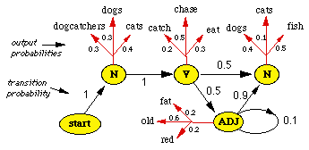
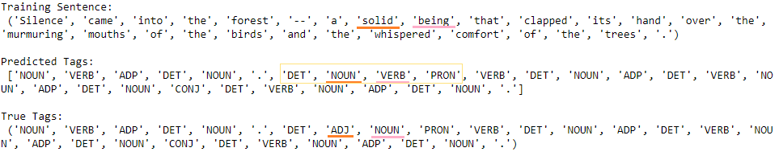

# Part-of-Speech Tagging with Hidden Markov Models

Natural Language Processing project implementing Part-of-Speech (POS) tagging using Hidden Markov Models (HMM) with the Pomegranate library. Achieved **96.02% test accuracy** on the Brown Corpus.

<p align="center"></p>

## Overview

This project implements a statistical approach to POS tagging using Hidden Markov Models. The model learns transition and emission probabilities from the Brown Corpus and predicts the most likely sequence of tags using the Viterbi algorithm.

## Dataset

- **Corpus**: Brown Corpus (Universal tagset)
- **Size**: ~53,000 sentences, ~1,160,000 words
- **Training Set**: 928,458 words
- **Test Set**: 232,734 words
- **Tags**: Universal POS tags (NOUN, VERB, ADJ, ADV, DET, PRON, etc.)

## Implementation

### Key Components:

1. **Hidden States** - Part-of-speech tags (hidden layer)
2. **Observations** - Words in the corpus (observable layer)
3. **Transition Probabilities** - P(tag_i | tag_i-1)
4. **Emission Probabilities** - P(word | tag)
5. **Viterbi Algorithm** - Finds most likely sequence of tags

### Technologies Used:

- **Language**: Python
- **Library**: Pomegranate (probabilistic modeling)
- **Framework**: Hidden Markov Models
- **Algorithm**: Viterbi path decoding

## Results

| Metric | Accuracy |
|--------|----------|
| **Training Accuracy** | 97.54% |
| **Test Accuracy** | 96.02% |

### Example Prediction:



### Analysis:

Although some tags were incorrectly predicted (underlined), the local sequence predictions ('DET', 'NOUN', 'VERB', 'PRON') make semantic sense. Expressions like "a man stated that" or "the doctor saw that" demonstrate the model's ability to capture local grammatical patterns, even when global context is challenging.

## Installation

1. Clone the repository
```bash
git clone https://github.com/dyadav4/Part-of-Speech-Tagging-with-HMM.git
cd Part-of-Speech-Tagging-with-HMM
```

2. Install dependencies
```bash
pip install pomegranate numpy pandas
```

3. Run the tagger
```bash
python POS_Tagger.py
```

## How It Works

1. **Training Phase**:
   - Calculate transition probabilities between tags
   - Calculate emission probabilities (word|tag)
   - Build HMM with pomegranate

2. **Prediction Phase**:
   - Apply Viterbi algorithm to find optimal tag sequence
   - Decode most probable path through hidden states

## Key Learnings

- Hidden Markov Model architecture
- Viterbi decoding algorithm
- Transition and emission probability matrices
- Statistical NLP approaches
- Pomegranate library for probabilistic modeling

## Future Improvements

- Add beam search for faster decoding
- Implement with other HMM libraries (hmmlearn)
- Try Conditional Random Fields (CRF) for comparison
- Add support for out-of-vocabulary words
- Implement deep learning approaches (BiLSTM-CRF)

## References

- Udacity Natural Language Processing Nanodegree
- Brown Corpus with Universal Tags
- Viterbi Algorithm

## Contact

- GitHub: [@dyadav4](https://github.com/dyadav4)

